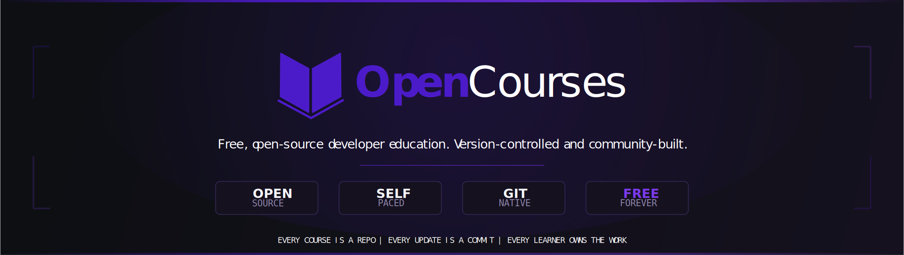

<div align="center">



<br/>
<br/>

[](https://opencourses-org.github.io/opencourses)
[](https://opencourses-org.github.io/opencourses/courses)
[](https://opencourses-org.github.io/opencourses/contributors)
[](https://github.com/opencourses-org/opencourses/actions)
[](LICENSE)

<br/>

```
Every course is a repo.  Every update is a commit.  Every contributor is a maintainer.
```

</div>

---

<br/>

## ✦ What Is OpenCourses?

> **The first developer education platform built entirely on GitHub infrastructure.**

OpenCourses is not a MOOC. It is not a wiki. It is not a docs site behind a login wall.

It is a living curriculum — where course content lives in Git repositories, learning progress is tracked in issues and pull requests, and every update ships exactly like a software release. Certificates are GPG-signed GitHub Releases. Grades are run in a hardened Docker sandbox. The leaderboard rebuilds itself every night.

**No servers. No subscriptions. No lock-in. No friction.**

<br/>

<div align="center">

```
┌─────────────────────────────────────────────────────────────────────┐
│                                                                     │
│   "Git is not a backup tool.                                        │
│    Code is not the only thing that should be version-controlled."   │
│                                                                     │
│    OpenCourses is what happens when you apply that idea to          │
│    developer education — radically, completely, without compromise. │
│                                                                     │
└─────────────────────────────────────────────────────────────────────┘
```

</div>

<br/>

---

## ✦ Why It Exists

Most online learning platforms share the same problems:

| The old way | The OpenCourses way |
|-------------|---------------------|
| Content locked behind accounts | Everything public, on GitHub |
| No version history — errors persist silently | Every change is a commit, every fix is a PR |
| Black-box grading you can't inspect | Open-source Docker sandbox grader |
| Certificates you can't verify | GPG-signed GitHub Releases — cryptographically provable |
| Stale courses with no accountability | Maintainer listed, version tagged, status tracked |
| Platform disappears → learning gone | Fork the repo → nothing lost |
| Expensive subscriptions | Free. Always. No exceptions. |

<br/>

---

## ✦ The Platform at a Glance

<br/>

<div align="center">

```
                         ╔══════════════════════════════╗
                         ║      github.com/opencourses  ║
                         ╚══════════════════╤═══════════╝
                                            │
              ┌─────────────────────────────┼──────────────────────────┐
              │                             │                          │
              ▼                             ▼                          ▼
    ┌─────────────────┐          ┌─────────────────┐        ┌──────────────────┐
    │   site/         │          │   engine/        │        │  .github/        │
    │                 │          │                  │        │  workflows/      │
    │  Astro 4        │          │  TypeScript      │        │                  │
    │  Static site    │          │  grading engine  │        │  19 automations  │
    │  GitHub Pages   │          │  Docker sandbox  │        │  Zero servers    │
    └────────┬────────┘          └────────┬─────────┘        └────────┬─────────┘
             │                           │                            │
             ▼                           ▼                            ▼
    opencourses-org         Grades code in < 60s          Enrolls · Certifies
    .github.io/opencourses  GPG signs certificates        Nudges · Ranks
```

</div>

<br/>

---

## ✦ How Learning Works

<br/>

```
  1. ENROLL ──────────────────────────────────────────────────────────────────
     Open an Issue using the "Enroll in a Course" template.
     Bot processes it instantly. Your student journey begins.

  2. LEARN ───────────────────────────────────────────────────────────────────
     Read Markdown content in this repo.
     Watch linked videos. Write code locally. No tracking. No timers.

  3. SUBMIT ──────────────────────────────────────────────────────────────────
     Open a Pull Request:  "[Stage 01] @your-username"
     GitHub Actions runs your code in a hardened Docker sandbox.
     Score + line-by-line feedback posted as a PR comment in ~45 seconds.

  4. QUIZ ────────────────────────────────────────────────────────────────────
     Open a "Quiz Attempt" issue. Claude grades it semantically —
     not keyword matching. You get real feedback, not just ✓ / ✗.

  5. ADVANCE ─────────────────────────────────────────────────────────────────
     Pass all stages? The bot unlocks Stage N+1 automatically.
     Fail? Feedback posted. Iterate. No penalty. No lock-out.

  6. CERTIFY ─────────────────────────────────────────────────────────────────
     All 5 stages cleared? A GPG-signed certificate is issued
     as a GitHub Release. Your name goes on the public leaderboard.
     The certificate lives on GitHub forever.
```

<br/>

---

## ✦ Course Catalog

<br/>

| Track | Courses | Difficulty | Description |
|-------|---------|-----------|-------------|
| 🔧 **Systems** | Rust Fundamentals · Async Rust · Systems Programming Plainly | ◆◆◆ Advanced | Memory, ownership, concurrency, OS internals |
| 🌐 **Web** | Modern CSS · TypeScript Type-Level · HTML Done Right | ◆◇◇ – ◆◆◆ | The frontend stack, actually understood |
| 🔒 **Security** | Web Security 101 · Applied Cryptography · Auth Patterns | ◆◇◇ – ◆◆◆ | XSS, CSRF, zero-trust, real cryptography |
| 🚀 **DevOps** | Docker Basics · Kubernetes Fastpath · Observability Core | ◆◆◇ Intermediate | Ship, operate, and observe production software |
| 📊 **Data** | Data Structures Revisited · Shell Mastery | ◆◇◇ – ◆◆◇ | Foundations that don't rot |
| 🏛️ **Foundations** | Git Internals · Computers from the Ground Up | ◆◇◇ – ◆◆◇ | First principles, not hand-waving |

<br/>

→ **[Browse all 16 courses with filters →](https://opencourses-org.github.io/opencourses/courses)**  
→ **[Explore the interactive knowledge graph →](https://opencourses-org.github.io/opencourses/tracks)**

<br/>

---

## ✦ Feature Highlights

<br/>

```
  ┌──────────────────────────┐   ┌──────────────────────────┐   ┌──────────────────────────┐
  │  ⌘K  Command Palette     │   │  ◉  Knowledge Graph       │   │  ▓  Build Status Bar      │
  │                          │   │                          │   │                          │
  │  Search any course,      │   │  Force-directed graph of  │   │  A real-time indicator   │
  │  track, or contributor   │   │  all 16 courses, colored  │   │  that the site was built │
  │  instantly. Keyboard     │   │  by track, linked by      │   │  fresh. Green = latest   │
  │  navigable, fuzzy-       │   │  prerequisites. Click     │   │  commit deployed. Not    │
  │  scored. No mouse.       │   │  any node to explore.     │   │  decorative — functional.│
  └──────────────────────────┘   └──────────────────────────┘   └──────────────────────────┘

  ┌──────────────────────────┐   ┌──────────────────────────┐   ┌──────────────────────────┐
  │  ⚡  60-Second Grades     │   │  🏆  Leaderboard          │   │  🎓  GPG Certificates     │
  │                          │   │                          │   │                          │
  │  Assignment PRs are      │   │  Rebuilt every night     │   │  Not a PDF. A signed     │
  │  graded in a hardened    │   │  from live GitHub data.  │   │  GitHub Release. Verify  │
  │  Docker sandbox. No      │   │  No manual updates.      │   │  it with gpg --verify.   │
  │  manual review needed    │   │  Always accurate.        │   │  Permanently public.     │
  │  for automated stages.   │   │                          │   │  Employer-checkable.     │
  └──────────────────────────┘   └──────────────────────────┘   └──────────────────────────┘
```

<br/>

---

## ✦ Repository Layout

```
opencourses/
│
├── 📁 .github/
│   ├── 📁 workflows/              19 GitHub Actions — the entire platform runs here
│   │   ├── deploy-site.yml        Astro build → GitHub Pages  (every push)
│   │   ├── enroll.yml             Process enrollment issues
│   │   ├── grade-assignment.yml   Docker sandbox grader
│   │   ├── run-quiz.yml           Claude AI quiz grading
│   │   ├── issue-cert.yml         GPG-signed certificate generation
│   │   ├── advance-stage.yml      Stage unlock logic
│   │   ├── leaderboard.yml        Nightly LEADERBOARD.md rebuild
│   │   ├── build-data.yml         Refresh live data every 6 hours
│   │   ├── validate-pr.yml        PR title + tamper detection
│   │   ├── plagiarism-check.yml   AST similarity on every submission
│   │   ├── peer-review-assign.yml Assign peer reviewers (Stage 5)
│   │   ├── mentorship-match.yml   Weekly mentor matching
│   │   ├── check-links.yml        Weekly dead-link scan
│   │   ├── check-videos.yml       Weekly YouTube oEmbed check
│   │   ├── dashboard.yml          Weekly DASHBOARD.md
│   │   ├── cohort-nudge.yml       Daily inactivity nudge
│   │   ├── stale-check.yml        Stale student cleanup
│   │   ├── audit-log.yml          Append-only event log
│   │   └── build-readme.yml       Auto-generate CURRICULUM.md
│   └── 📁 ISSUE_TEMPLATE/         Enrollment, quiz, support forms
│
├── 📁 site/                       ★ The website — touch this to add courses
│   └── src/
│       ├── data/oc.ts             ★ Course catalog (single source of truth)
│       ├── content/courses/       ★ Per-course Markdown content
│       ├── pages/                 One .astro file per route
│       ├── components/            Shared Astro components
│       └── styles/global.css      Full design system, no framework
│
└── 📁 engine/                     The grading engine — stable, do not modify
    ├── curriculum/                Stage content, quizzes, exercises
    ├── scripts/                   17 TypeScript automation scripts
    ├── scripts/graders/           Per-stage Docker test runners
    └── sandbox/Dockerfile         Hardened grading container
```

<br/>

---

## ✦ Adding a Course

> **You only need to touch `site/`. Nothing else.**

### 1 — Add to the catalog

Open **[`site/src/data/oc.ts`](site/src/data/oc.ts)** and add to the `COURSES` array:

```ts
{
  slug: "your-course-slug",          // → /courses/your-course-slug
  title: "Your Course Title",
  description: "One sentence. What will students be able to do after this?",
  track: "foundations",              // systems | web | security | devops | data | foundations
  difficulty: "beginner",            // beginner | intermediate | advanced | draft
  duration: "5h",
  modules: 8,
  maintainer: "your-github-login",
  contributors: ["your-github-login"],
  tags: ["tag1", "tag2"],
  prerequisites: [],                 // slugs of prerequisite courses
  repo: "opencourses-org/opencourses",
  version: "v1.0.0",
  updatedAt: "2026-05-19T00:00:00Z",
  featured: false,
  stars: 0, forks: 0, openIssues: 0,
  status: "added",
  lastCommit: "Initial release",
},
```

The course page generates automatically. No routing config, no component changes.

### 2 — Write the content

Create **`site/src/content/courses/your-course-slug.md`**:

```markdown
---
title: "Your Course Title"
description: "One sentence."
track: "foundations"
difficulty: "beginner"
modules: 8
duration: "5h"
updatedAt: "2026-05-19T00:00:00Z"
status: "added"
tags: ["tag1", "tag2"]
stars: 0
version: "v1.0.0"
maintainer: "your-github-login"
repo: "opencourses-org/opencourses"
prerequisites: []
---

Your course overview. What is this? Who is it for? What will students build?

## What You'll Build
- Project or skill 1
- Project or skill 2

## Prerequisites
- What students should already know
```

### 3 — Push

```bash
git add site/src/data/oc.ts site/src/content/courses/your-course-slug.md
git commit -m "course: add Your Course Title"
git push
```

**Live in 60 seconds.**

<br/>

---

## ✦ Contributing

<br/>

We welcome contributions of all kinds.

| Type | How |
|------|-----|
| 📚 **New course** | Follow "Adding a Course" above → open a PR |
| ✏️ **Fix content** | Edit `site/src/data/oc.ts` or the course `.md` → PR |
| 🐛 **Report error** | Open an issue with the `content-fix` label |
| 💡 **Suggest course** | Open an issue — describe topic, audience, and why it's missing |
| 🌍 **Translate** | Open an issue to coordinate before starting |
| 🎨 **Improve site** | Open a PR against anything in `site/` |

### Ground rules

1. **Write for practitioners.** Assume the student can use a terminal and has shipped something. Don't explain what a variable is.
2. **No paywalled resources.** All exercises, readings, and prerequisites must be freely accessible.
3. **Own your course.** You are the maintainer. Keep it accurate. Use `status: "attention"` when you need help.
4. **One PR per course.** Don't bundle unrelated changes.
5. **Be honest about state.** `difficulty: "draft"` exists for a reason. Use it.

We follow the [Contributor Covenant v2.1](https://www.contributor-covenant.org/version/2/1/code_of_conduct/).

<br/>

---

## ✦ Tech Stack

<br/>

| Layer | Technology | Notes |
|-------|-----------|-------|
| Site framework | [Astro 4](https://astro.build) — `output: static` | Zero JS framework shipped to browsers |
| Interactivity | Vanilla JS IIFEs | Catalog filter, force-directed graph, ⌘K palette |
| Styling | Custom CSS design system | 42 KB total, no Tailwind, no utility classes |
| Fonts | DM Sans + JetBrains Mono + Sora | Google Fonts, loaded from CDN |
| Knowledge graph | Custom force simulation | No D3 — pure physics in ~150 lines of JS |
| Hosting | GitHub Pages | Free, org-native, zero-config after setup |
| CI/CD | GitHub Actions | Build, deploy, grade, certify — all in one place |
| Grading | Docker on `ubuntu-latest` | Reproducible, isolated, zero server cost |
| Quiz grading | Claude API (Anthropic) | Semantic evaluation, not keyword matching |
| Certificates | GPG-signed GitHub Releases | Cryptographically verifiable, permanently public |

**What actually loads in a user's browser:**

```
CSS (entire design system)   →  42 KB   (one file, cached)
Global JS (theme + ⌘K)      →   2 KB
Page JS (only where needed)  →  6–9 KB  (catalog / graph)
HTML (pre-rendered)          →  30–150 KB per page
Fonts (Google Fonts CDN)     →  ~60 KB  (cached after first visit)
─────────────────────────────────────────────────────
Total first load             →  ~250 KB
No React. No hydration. No bundle. No runtime.
```

<br/>

---

## ✦ Deployment

```
  push to main  →  deploy-site.yml triggers
                         │
                   bun install + astro build
                   (SITE_URL, BASE_PATH from repo vars)
                         │
                   site/dist/ uploaded to GitHub Pages
                         │
                   Live at:
                   https://opencourses-org.github.io/opencourses
```

Trigger manually: **Actions → Deploy Site to GitHub Pages → Run workflow**

<br/>

---

## ✦ Quick Links

<br/>

<div align="center">

| 🌐 [Website](https://opencourses-org.github.io/opencourses) | 📚 [Courses](https://opencourses-org.github.io/opencourses/courses) | 🗺️ [Knowledge Graph](https://opencourses-org.github.io/opencourses/tracks) |
|:---:|:---:|:---:|
| **👥 [Contributors](https://opencourses-org.github.io/opencourses/contributors)** | **📋 [Curriculum](engine/CURRICULUM.md)** | **🏆 [Leaderboard](engine/LEADERBOARD.md)** |
| **📅 [Changelog](https://opencourses-org.github.io/opencourses/changelog)** | **🎓 [Certified](engine/CERTIFIED.md)** | **🛠️ [Setup Guide](SETUP.md)** |

</div>

<br/>

---

## ✦ License

<br/>

This project uses a two-tier licensing model:

**Platform code** (`site/`, `engine/`, `.github/`) is released under the **[OpenCourses Community License](LICENSE)** — source-available, contributions welcome, ownership retained by opencourses-org. You may fork, study, contribute, and self-host for non-commercial use. You may not redistribute as a competing product or remove attribution.

**Course content** (`site/src/content/`, `engine/curriculum/`) is released under **[CC BY-NC 4.0](https://creativecommons.org/licenses/by-nc/4.0/)** — free to use, adapt, and share with attribution for non-commercial purposes.

> The name "OpenCourses", the wordmark, and the visual identity are owned by opencourses-org and may not be used in derived works without written permission.

For commercial licensing: **legal@opencourses.dev**

<br/>

---

## ✦ Security

Found a vulnerability? **Do not open a public issue.**

Report privately via [GitHub Security Advisories](https://github.com/opencourses-org/opencourses/security/advisories/new). We respond within 72 hours. See [SECURITY.md](.github/SECURITY.md) for our full disclosure policy.

<br/>

---

<div align="center">

<br/>

```
Built in the open.  Shipped like software.  Free, forever.
```

<br/>

**[opencourses-org.github.io/opencourses](https://opencourses-org.github.io/opencourses)**

<br/>

<sub>Copyright © 2026 opencourses-org · <a href="LICENSE">OpenCourses Community License</a> · <a href="https://creativecommons.org/licenses/by-nc/4.0/">CC BY-NC 4.0</a> for content</sub>

</div>
